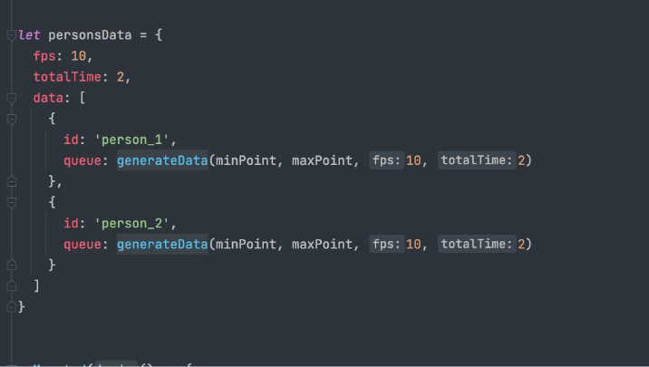

### 接口定义

#### 1.数据格式



```json

{
  "fps": 1,
  "totalTime": 2,
  "data": [
    {
      "id": "person_1",
      "queue": [
        {
          "x": 0,
          "y": 0
        },
        {
          "x": 0.23,
          "y": 0.24
        }
      ]
    },
    {
      "id": "person_2",
      "queue": [
        {
          "x": 0.12,
          "y": 0.14
        },
        {
          "x": 0.33,
          "y": 0.24
        }
      ]
    }
  ]
}

```

    fps: 表示帧数，即每秒刷新多少次
    totalTime: 表示数据时长
    data:  实际数据数组，多少人就多少个
        其中id 为 人员唯一标识
        queue 为 人员点位数组，按照顺序排布,总量应为 totalTime*fps

#### 2.接口方式:

    http 发送或者 直存数据库

http 发送方式 接口url格式    http://ip:port/api/personTrack 请求方式 POST 数据为以json封装发送 可用httpie 进行测试

```shell
http POST :8081/api/personTrack < track.json
```

存储数据库方式
    直接将该格式数据存入redis 数据库中ttl 设置为与totalTime 相等 key 为 personTrack
